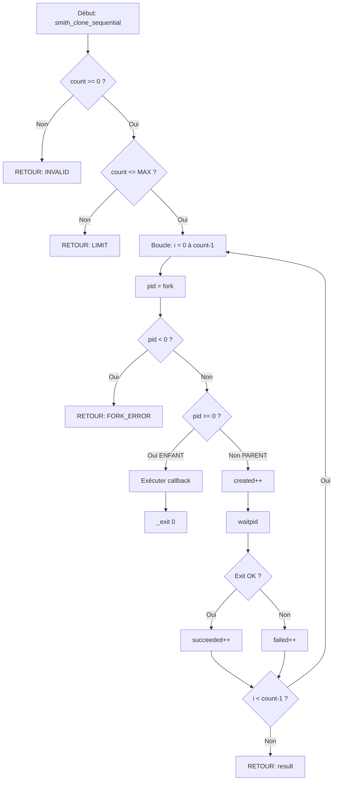

<thinking>
## Analyse du Concept
- Concept : fork() system call, Copy-On-Write, Process Hierarchy
- Phase demandée : 2
- Adapté ? OUI - fork() est fondamental et bien adapté à la Phase 2

## Combo Base + Bonus
- Exercice de base : Implémenter fork séquentiel, parallèle, et arbre de processus
- Bonus : COW Demonstrator avec mesures précises et optimisation zero-copy
- Palier bonus : 🔥 Avancé (complexité système, mesures mémoire)
- Progression logique ? OUI - base = patterns de fork, bonus = comprendre COW en profondeur

## Prérequis & Difficulté
- Prérequis réels : Concepts processus (ex00), pointeurs, mémoire
- Difficulté estimée : 5/10 (base), 7/10 (bonus)
- Cohérent avec phase ? OUI - Phase 2 = 4-6/10

## Aspect Fun/Culture
- Contexte choisi : THE MATRIX - Agent Smith qui se duplique!
- MEME mnémotechnique : "Mr. Anderson... I'm going to enjoy watching you die... again, and again, and again" (Smith cloning)
- Pourquoi c'est fun :
  - Agent Smith = fork() (il se duplique à l'infini)
  - Copy-On-Write = "The Matrix" (illusion de copie, réalité partagée)
  - Parent/Child = Neo/Trinity vs Matrix
  - Fork bomb = Smith overwhelming the Matrix
  - L'analogie est PARFAITE

## Scénarios d'Échec (5 mutants concrets)
1. Mutant A (Boundary) : `for (int i = 0; i <= count; i++)` - crée un enfant de trop
2. Mutant B (Safety) : Pas de vérification `if (pid < 0)` après fork()
3. Mutant C (Resource) : Oubli de wait() → zombies créés
4. Mutant D (Logic) : Utiliser `exit()` au lieu de `_exit()` dans l'enfant → double flush
5. Mutant E (Return) : L'enfant continue la boucle et fork aussi → fork bomb

## Verdict
VALIDE - L'exercice est excellent avec le thème Matrix parfaitement adapté
</thinking>

---

# Exercice 2.2.1 : smith_clone_master

**Module :**
2.2 — Processes & Shell

**Concept :**
a — fork() System Call & Copy-On-Write

**Difficulté :**
★★★★★☆☆☆☆☆ (5/10)

**Type :**
code

**Tiers :**
1 — Concept isolé

**Langage :**
C (C17)

**Prérequis :**
- Module 2.2 ex00 (concepts processus)
- Pointeurs et arithmétique de pointeurs
- Gestion mémoire basique

**Domaines :**
Process, Mem

**Durée estimée :**
180 min

**XP Base :**
250

**Complexité :**
T3 O(n) × S2 O(n)

---

## 📐 SECTION 1 : PROTOTYPE & CONSIGNE

### 1.1 Obligations

**Fichiers à rendre :**
```
ex01/
├── smith_clone.h       # Header avec structures et prototypes
├── smith_clone.c       # Implémentation des patterns de fork
├── oracle_cow.c        # Démonstrateur Copy-On-Write
├── matrix_utils.c      # Utilitaires (wait, error handling)
└── Makefile            # Compilation et tests
```

**Fonctions autorisées :**
```
fork, wait, waitpid, getpid, getppid, exit, _exit
malloc, free, calloc, memset, memcpy, memmove
printf, fprintf, perror, write
open, close, read
usleep, sleep, getrusage, sysconf
WIFEXITED, WEXITSTATUS, WIFSIGNALED, WTERMSIG
```

**Fonctions interdites :**
```
exec*, system, popen, pthread_*, clone
```

### 1.2 Consigne

**🎬 THE MATRIX : "Mr. Anderson... Je vais adorer vous regarder mourir... encore, et encore, et encore"**

Dans The Matrix Revolutions, l'Agent Smith découvre comment se **dupliquer** à l'infini. Chaque copie est identique à l'original, partageant la même mémoire (Copy-On-Write) jusqu'à ce qu'elle diverge. Ta mission : reproduire ce pouvoir de duplication avec l'appel système `fork()`.

**Contexte :**
- **Agent Smith** = Processus parent qui se duplique via `fork()`
- **Les Clones** = Processus enfants, copies parfaites du parent
- **Copy-On-Write** = L'illusion de la Matrix - tout semble copié mais les données sont partagées jusqu'à modification
- **Neo** = Toi, qui doit comprendre et contrôler ce pouvoir

**Ta mission :**

Implémenter une bibliothèque de patterns de duplication de processus ("clonage de Smith") avec :

1. **`smith_clone_sequential()`** : Créer N clones un par un (chaque clone termine avant le suivant)
2. **`smith_army_spawn()`** : Créer N clones en parallèle (armée de Smith)
3. **`matrix_hierarchy_build()`** : Créer un arbre de processus (hiérarchie de la Matrix)
4. **`oracle_predict_copy()`** : Démontrer le mécanisme Copy-On-Write

**Entrée :**
- `count` (int) : Nombre de clones à créer
- `callback` (fonction) : Action exécutée par chaque clone
- `data` (void*) : Données passées au callback
- `config` (structure) : Configuration pour l'arbre de processus

**Sortie :**
- Structure `clone_result_t` contenant :
  - `created` : Nombre de clones créés
  - `succeeded` : Nombre de clones terminés avec succès
  - `failed` : Nombre de clones terminés en erreur
  - `error` : Code d'erreur si applicable

**Contraintes :**
- Protection contre les "fork bombs" (limite: 1000 processus max)
- Les enfants doivent utiliser `_exit()`, pas `exit()`
- Tous les enfants doivent être attendus (pas de zombies)
- Vérification systématique du retour de `fork()`

**Exemples :**

| Appel | Résultat | Explication |
|-------|----------|-------------|
| `smith_clone_sequential(3, NULL, NULL)` | `{created:3, succeeded:3, failed:0}` | 3 clones créés et terminés séquentiellement |
| `smith_army_spawn(5, work_fn, data)` | `{created:5, succeeded:5, failed:0}` | 5 clones en parallèle |
| `matrix_hierarchy_build({depth:2, branches:2})` | 7 processus | 1 + 2 + 4 = 7 (arbre complet) |
| `smith_clone_sequential(-1, NULL, NULL)` | `{error: CLONE_ERR_INVALID}` | Paramètre invalide |

### 1.2.2 Consigne Académique

Implémenter une bibliothèque de création de processus utilisant l'appel système `fork()`.

L'implémentation doit supporter trois patterns de création :
1. **Séquentiel** : Créer N processus enfants, chaque enfant est créé après la terminaison du précédent
2. **Parallèle** : Créer N processus enfants simultanément, tous s'exécutent en parallèle
3. **Arbre** : Créer une hiérarchie de processus avec profondeur et branchement configurables

De plus, implémenter un démonstrateur du mécanisme Copy-On-Write (COW) permettant de mesurer la consommation mémoire avant/après fork et après modification des données.

### 1.3 Prototype

```c
#ifndef SMITH_CLONE_H
#define SMITH_CLONE_H

#include <sys/types.h>
#include <stddef.h>

/* Limites de sécurité - Protection contre fork bomb */
#define CLONE_MAX_AGENTS     1000
#define CLONE_MAX_DEPTH      10
#define CLONE_MAX_BRANCHES   10

/* Codes de retour */
typedef enum {
    CLONE_SUCCESS = 0,
    CLONE_ERR_INVALID = -1,    /* Paramètres invalides */
    CLONE_ERR_FORK = -2,       /* Échec de fork() */
    CLONE_ERR_LIMIT = -3,      /* Limite de processus atteinte */
    CLONE_ERR_CHILD = -4       /* Un enfant a échoué */
} clone_error_t;

/* Callback exécuté par chaque clone */
typedef void (*clone_callback_t)(int index, void *data);

/* Résultat d'une opération de clonage */
typedef struct {
    int created;              /* Nombre de clones créés */
    int succeeded;            /* Nombre de clones terminés avec succès */
    int failed;               /* Nombre de clones terminés en erreur */
    clone_error_t error;      /* Code d'erreur si applicable */
} clone_result_t;

/* Configuration de l'arbre Matrix */
typedef struct {
    int depth;                /* Profondeur de l'arbre */
    int branches;             /* Nombre de branches par noeud */
    clone_callback_t callback;/* Fonction exécutée par chaque noeud */
    void *data;               /* Données passées au callback */
} matrix_tree_config_t;

/* Statistiques COW */
typedef struct {
    size_t buffer_size;       /* Taille du buffer alloué */
    size_t pages_total;       /* Nombre total de pages */
    size_t pages_shared;      /* Pages partagées (estimées) */
    size_t pages_private;     /* Pages privées (copiées) */
    size_t rss_before_fork;   /* RSS avant fork (kB) */
    size_t rss_after_fork;    /* RSS après fork (kB) */
    size_t rss_after_modify;  /* RSS après modification (kB) */
} oracle_cow_stats_t;

/**
 * Crée N clones séquentiellement (comme Smith au début)
 * Chaque clone est créé après la terminaison du précédent.
 */
clone_result_t smith_clone_sequential(int count, clone_callback_t callback, void *data);

/**
 * Crée N clones en parallèle (l'armée de Smith dans Revolutions)
 * Tous les clones sont créés avant d'attendre leur terminaison.
 */
clone_result_t smith_army_spawn(int count, clone_callback_t callback, void *data);

/**
 * Crée un arbre de processus (hiérarchie de la Matrix)
 * depth=2, branches=2 → 1 + 2 + 4 = 7 processus
 */
int matrix_hierarchy_build(const matrix_tree_config_t *config);

/**
 * Calcule le nombre total de processus pour une configuration d'arbre.
 */
int matrix_count_agents(int depth, int branches);

/**
 * L'Oracle prédit et démontre le Copy-On-Write.
 * Alloue un buffer, fork, et mesure la progression de la copie.
 */
clone_error_t oracle_predict_copy(size_t buffer_size, int modify_percent,
                                   oracle_cow_stats_t *stats);

/**
 * Neo perçoit la mémoire RSS courante du processus.
 */
size_t neo_sense_memory(void);

/**
 * Retourne une description textuelle d'un code d'erreur.
 */
const char *clone_strerror(clone_error_t error);

#endif /* SMITH_CLONE_H */
```

---

## 💡 SECTION 2 : LE SAVIEZ-VOUS ?

### 2.1 L'appel système fork() : La Duplication Parfaite

`fork()` est l'un des appels système les plus élégants et les plus mal compris d'Unix. Quand vous appelez `fork()`, le kernel ne copie PAS toute la mémoire du processus. Il utilise une technique appelée **Copy-On-Write** (COW) :

```
AVANT FORK:
┌────────────────────────────────────────┐
│ Processus Parent (PID 1000)            │
│ ┌────────────────────────────────────┐ │
│ │ Mémoire Virtuelle : 100 MB         │ │
│ │ Pages Physiques  : 25,600          │ │
│ └────────────────────────────────────┘ │
└────────────────────────────────────────┘

APRÈS FORK (COW en action):
┌─────────────────────────┐     ┌─────────────────────────┐
│ Parent (PID 1000)       │     │ Enfant (PID 1001)       │
│ Mémoire: 100 MB virtuel │     │ Mémoire: 100 MB virtuel │
└───────────┬─────────────┘     └───────────┬─────────────┘
            │                               │
            └───────────┬───────────────────┘
                        ▼
              ┌─────────────────────┐
              │ Pages PARTAGÉES     │
              │ (Read-Only)         │
              │ 25,600 pages        │
              │ Coût réel: ~0       │
              └─────────────────────┘
```

**Le génie du COW :** Le fork() semble instantané même pour un processus de plusieurs gigaoctets car AUCUNE copie réelle n'est faite. Les pages ne sont copiées que lorsqu'un des processus tente de les MODIFIER.

### 2.2 Le Retour Triple de fork()

```c
pid_t pid = fork();

if (pid < 0) {
    // 🔴 Erreur : fork() a échoué
    // Causes : limite de processus, mémoire insuffisante
}
else if (pid == 0) {
    // 🟢 Code exécuté dans l'ENFANT
    // pid vaut 0 dans l'enfant
}
else {
    // 🔵 Code exécuté dans le PARENT
    // pid contient le PID de l'enfant créé
}
```

**Analogie Matrix :** C'est comme prendre la pilule rouge (pid > 0 = tu es l'original) ou la pilule bleue (pid == 0 = tu es le clone).

### 2.5 DANS LA VRAIE VIE

| Métier | Utilisation de fork() |
|--------|----------------------|
| **DevOps/SRE** | Serveurs web "prefork" (Apache), démons Unix, processus de monitoring |
| **Développeur Système** | Shells (bash fork pour chaque commande), gestionnaires de services (systemd) |
| **Data Engineer** | Traitement parallèle de données, workers de queue |
| **Développeur Backend** | Serveurs multiprocessus (Gunicorn, Unicorn), isolation des requêtes |
| **Security Engineer** | Sandboxing par processus, isolation de code malveillant |

---

## 🖥️ SECTION 3 : EXEMPLE D'UTILISATION

### 3.0 Session bash

```bash
$ ls
smith_clone.h  smith_clone.c  oracle_cow.c  matrix_utils.c  main.c  Makefile

$ make

$ ./test_smith
=== Test Sequential Cloning ===
Parent (The Architect) PID: 12000
Creating 3 Smith clones sequentially...

Smith Clone 0 (PID 12001): "I'm going to enjoy watching you die"
Smith Clone 1 (PID 12002): "I'm going to enjoy watching you die"
Smith Clone 2 (PID 12003): "I'm going to enjoy watching you die"

Results: created=3, succeeded=3, failed=0

=== Test Parallel Army ===
Spawning Smith's army of 5...
[All clones start simultaneously]
Clone 2 finished first (shortest task)
Clone 0 finished
Clone 4 finished
Clone 1 finished
Clone 3 finished last

Results: created=5, succeeded=5, failed=0

=== Test Matrix Hierarchy ===
Building Matrix hierarchy (depth=2, branches=2)...
Expected: 7 agents

Agent at depth 0, branch 0 (PID 12010, PPID 12000)
Agent at depth 1, branch 0 (PID 12011, PPID 12010)
Agent at depth 1, branch 1 (PID 12012, PPID 12010)
Agent at depth 2, branch 0 (PID 12013, PPID 12011)
Agent at depth 2, branch 1 (PID 12014, PPID 12011)
Agent at depth 2, branch 0 (PID 12015, PPID 12012)
Agent at depth 2, branch 1 (PID 12016, PPID 12012)

Total created: 7 agents

All tests passed!
```

### 3.1 🔥 BONUS AVANCÉ (OPTIONNEL)

**Difficulté Bonus :**
★★★★★★★☆☆☆ (7/10)

**Récompense :**
XP ×3

**Time Complexity attendue :**
O(n) pour les mesures

**Space Complexity attendue :**
O(1) auxiliaire (buffer de test exclu)

**Domaines Bonus :**
`Mem, CPU`

#### 3.1.1 Consigne Bonus

**🎬 L'ORACLE PRÉDIT TOUT : Copy-On-Write Mastery**

L'Oracle peut voir le futur... et le passé de la mémoire. Ta mission : implémenter un démonstrateur COW qui PROUVE visuellement que le kernel utilise le Copy-On-Write.

**Ta mission :**

Implémenter `oracle_predict_copy()` qui :
1. Alloue un grand buffer (ex: 100 MB)
2. Fork le processus
3. Mesure la mémoire RSS AVANT modification
4. Modifie progressivement X% du buffer dans l'enfant
5. Mesure la mémoire RSS APRÈS modification
6. Affiche les statistiques prouvant le COW

**Contraintes :**
```
┌─────────────────────────────────────────┐
│  1 MB ≤ buffer_size ≤ 500 MB            │
│  0 ≤ modify_percent ≤ 100               │
│  Précision mesure : ± 5%                │
│  Temps limite : O(n) où n = buffer_size │
└─────────────────────────────────────────┘
```

**Exemples :**

| buffer_size | modify_percent | Résultat attendu |
|-------------|----------------|------------------|
| 100 MB | 0% | RSS enfant ≈ quelques KB (COW total) |
| 100 MB | 50% | RSS enfant ≈ 50 MB (moitié copiée) |
| 100 MB | 100% | RSS enfant ≈ 100 MB (copie complète) |

#### 3.1.2 Prototype Bonus

```c
clone_error_t oracle_predict_copy(size_t buffer_size, int modify_percent,
                                   oracle_cow_stats_t *stats);
```

#### 3.1.3 Ce qui change par rapport à l'exercice de base

| Aspect | Base | Bonus |
|--------|------|-------|
| Focus | Patterns de fork | Mesure COW |
| Complexité | Gestion processus | Analyse mémoire système |
| Difficulté | 5/10 | 7/10 |
| Domaines | Process | Process + Mem + CPU |

---

## ✅❌ SECTION 4 : ZONE CORRECTION

### 4.1 Moulinette (Tableau des Tests)

| Test | Description | Input | Expected | Points |
|------|-------------|-------|----------|--------|
| 01 | Sequential 5 clones | `smith_clone_sequential(5, NULL, NULL)` | `created=5, succeeded=5` | 3 |
| 02 | Parallel 5 clones | `smith_army_spawn(5, NULL, NULL)` | `created=5, succeeded=5` | 3 |
| 03 | Sequential 0 | `smith_clone_sequential(0, NULL, NULL)` | `created=0, SUCCESS` | 2 |
| 04 | Parallel 0 | `smith_army_spawn(0, NULL, NULL)` | `created=0, SUCCESS` | 2 |
| 05 | Invalid negative | `smith_clone_sequential(-1, NULL, NULL)` | `CLONE_ERR_INVALID` | 2 |
| 06 | Hierarchy depth=1, branches=3 | `matrix_hierarchy_build({1, 3, NULL, NULL})` | 4 processus | 3 |
| 07 | Hierarchy depth=2, branches=2 | `matrix_hierarchy_build({2, 2, NULL, NULL})` | 7 processus | 3 |
| 08 | Count agents | `matrix_count_agents(3, 2)` | 15 | 2 |
| 09 | Limit protection | `smith_army_spawn(CLONE_MAX_AGENTS+1, NULL, NULL)` | `CLONE_ERR_LIMIT` | 3 |
| 10 | Callback execution | Callback increments shared counter | All callbacks executed | 3 |
| 11 | Child failure detection | Callback with `_exit(1)` for index 2 | `failed >= 1` | 3 |
| 12 | No zombies | `smith_army_spawn(10, ...)` then `ps aux \| grep defunct` | 0 zombies | 5 |
| 13 | Valgrind clean | Full test suite | 0 leaks in parent | 5 |
| 14 | COW demo 0% | `oracle_predict_copy(10MB, 0, &stats)` | `rss_after_fork < rss_before_fork` | 3 |
| 15 | COW demo 100% | `oracle_predict_copy(10MB, 100, &stats)` | `rss_after_modify ≈ rss_before_fork` | 3 |
| 16 | Error string | `clone_strerror(CLONE_ERR_FORK)` | Non-NULL string | 1 |

### 4.2 main.c de test

```c
#include "smith_clone.h"
#include <stdio.h>
#include <stdlib.h>
#include <unistd.h>
#include <assert.h>

void smith_says(int index, void *data)
{
    const char *msg = data ? (const char *)data : "I am inevitable";
    printf("Smith Clone %d (PID %d): \"%s\"\n", index, getpid(), msg);
    usleep(10000); /* 10ms */
}

void test_sequential(void)
{
    printf("\n=== Test 1: Sequential Cloning ===\n");
    clone_result_t r = smith_clone_sequential(3, smith_says,
                                               "I'm going to enjoy watching you die");
    assert(r.created == 3);
    assert(r.succeeded == 3);
    assert(r.error == CLONE_SUCCESS);
    printf("PASS: Sequential cloning works\n");
}

void test_parallel(void)
{
    printf("\n=== Test 2: Parallel Army ===\n");
    clone_result_t r = smith_army_spawn(5, smith_says, "We are Smith");
    assert(r.created == 5);
    assert(r.succeeded == 5);
    printf("PASS: Parallel army works\n");
}

void test_hierarchy(void)
{
    printf("\n=== Test 3: Matrix Hierarchy ===\n");
    int expected = matrix_count_agents(2, 2);
    printf("Expected agents: %d\n", expected);

    matrix_tree_config_t config = {
        .depth = 2,
        .branches = 2,
        .callback = NULL,
        .data = NULL
    };

    int created = matrix_hierarchy_build(&config);
    assert(created == expected);
    printf("PASS: Hierarchy created %d agents\n", created);
}

void test_invalid(void)
{
    printf("\n=== Test 4: Invalid Parameters ===\n");
    clone_result_t r = smith_clone_sequential(-1, NULL, NULL);
    assert(r.error == CLONE_ERR_INVALID);
    printf("PASS: Invalid parameters rejected\n");
}

void test_limit(void)
{
    printf("\n=== Test 5: Limit Protection ===\n");
    clone_result_t r = smith_army_spawn(CLONE_MAX_AGENTS + 1, NULL, NULL);
    assert(r.error == CLONE_ERR_LIMIT);
    printf("PASS: Fork bomb protection works\n");
}

int main(void)
{
    printf("=== SMITH CLONE MASTER TEST SUITE ===\n");
    printf("Parent PID: %d\n", getpid());

    test_sequential();
    test_parallel();
    test_hierarchy();
    test_invalid();
    test_limit();

    printf("\n=== ALL TESTS PASSED ===\n");
    return 0;
}
```

### 4.3 Solution de référence

```c
#include "smith_clone.h"
#include <sys/wait.h>
#include <unistd.h>
#include <stdio.h>
#include <stdlib.h>
#include <string.h>

static int g_total_created = 0;

clone_result_t smith_clone_sequential(int count, clone_callback_t callback, void *data)
{
    clone_result_t result = {0, 0, 0, CLONE_SUCCESS};

    if (count < 0)
    {
        result.error = CLONE_ERR_INVALID;
        return result;
    }
    if (count > CLONE_MAX_AGENTS)
    {
        result.error = CLONE_ERR_LIMIT;
        return result;
    }

    for (int i = 0; i < count; i++)
    {
        pid_t pid = fork();

        if (pid < 0)
        {
            result.error = CLONE_ERR_FORK;
            return result;
        }
        else if (pid == 0)
        {
            /* Enfant */
            if (callback)
                callback(i, data);
            _exit(0);
        }
        else
        {
            /* Parent */
            result.created++;
            int status;
            waitpid(pid, &status, 0);

            if (WIFEXITED(status) && WEXITSTATUS(status) == 0)
                result.succeeded++;
            else
                result.failed++;
        }
    }

    return result;
}

clone_result_t smith_army_spawn(int count, clone_callback_t callback, void *data)
{
    clone_result_t result = {0, 0, 0, CLONE_SUCCESS};

    if (count < 0)
    {
        result.error = CLONE_ERR_INVALID;
        return result;
    }
    if (count > CLONE_MAX_AGENTS)
    {
        result.error = CLONE_ERR_LIMIT;
        return result;
    }

    pid_t *pids = malloc(sizeof(pid_t) * count);
    if (!pids && count > 0)
    {
        result.error = CLONE_ERR_FORK;
        return result;
    }

    /* Créer tous les enfants */
    for (int i = 0; i < count; i++)
    {
        pid_t pid = fork();

        if (pid < 0)
        {
            result.error = CLONE_ERR_FORK;
            /* Attendre les enfants déjà créés */
            for (int j = 0; j < i; j++)
                waitpid(pids[j], NULL, 0);
            free(pids);
            return result;
        }
        else if (pid == 0)
        {
            free(pids);
            if (callback)
                callback(i, data);
            _exit(0);
        }
        else
        {
            pids[i] = pid;
            result.created++;
        }
    }

    /* Attendre tous les enfants */
    for (int i = 0; i < count; i++)
    {
        int status;
        waitpid(pids[i], &status, 0);

        if (WIFEXITED(status) && WEXITSTATUS(status) == 0)
            result.succeeded++;
        else
            result.failed++;
    }

    free(pids);
    return result;
}

int matrix_count_agents(int depth, int branches)
{
    if (depth < 0 || branches < 0)
        return -1;
    if (branches == 0)
        return 1;

    int total = 0;
    int level_count = 1;

    for (int i = 0; i <= depth; i++)
    {
        total += level_count;
        if (total > CLONE_MAX_AGENTS)
            return -1;
        level_count *= branches;
    }

    return total;
}

static int tree_recursive(const matrix_tree_config_t *config, int current_depth)
{
    int created = 1; /* Compte ce noeud */

    if (config->callback)
        config->callback(current_depth, config->data);

    if (current_depth >= config->depth)
        return created;

    for (int b = 0; b < config->branches; b++)
    {
        pid_t pid = fork();

        if (pid < 0)
            return -1;
        else if (pid == 0)
        {
            int child_created = tree_recursive(config, current_depth + 1);
            _exit(child_created > 0 ? 0 : 1);
        }
        else
        {
            int status;
            waitpid(pid, &status, 0);
            if (WIFEXITED(status))
            {
                int subtree = matrix_count_agents(config->depth - current_depth - 1,
                                                   config->branches);
                created += subtree;
            }
        }
    }

    return created;
}

int matrix_hierarchy_build(const matrix_tree_config_t *config)
{
    if (!config || config->depth < 0 || config->branches < 0)
        return -1;
    if (config->depth > CLONE_MAX_DEPTH || config->branches > CLONE_MAX_BRANCHES)
        return -1;

    int expected = matrix_count_agents(config->depth, config->branches);
    if (expected < 0 || expected > CLONE_MAX_AGENTS)
        return -1;

    return tree_recursive(config, 0);
}

const char *clone_strerror(clone_error_t error)
{
    switch (error)
    {
        case CLONE_SUCCESS:     return "Success";
        case CLONE_ERR_INVALID: return "Invalid parameters";
        case CLONE_ERR_FORK:    return "Fork failed";
        case CLONE_ERR_LIMIT:   return "Process limit exceeded";
        case CLONE_ERR_CHILD:   return "Child process failed";
        default:                return "Unknown error";
    }
}
```

### 4.4 Solutions alternatives acceptées

```c
/* Alternative 1: Utiliser wait() au lieu de waitpid() */
clone_result_t smith_clone_sequential_v2(int count, clone_callback_t cb, void *data)
{
    clone_result_t r = {0, 0, 0, CLONE_SUCCESS};
    if (count < 0) { r.error = CLONE_ERR_INVALID; return r; }
    if (count > CLONE_MAX_AGENTS) { r.error = CLONE_ERR_LIMIT; return r; }

    for (int i = 0; i < count; i++)
    {
        pid_t pid = fork();
        if (pid < 0) { r.error = CLONE_ERR_FORK; return r; }
        if (pid == 0) { if (cb) cb(i, data); _exit(0); }

        r.created++;
        int status;
        wait(&status);  /* wait() au lieu de waitpid() - OK car séquentiel */
        if (WIFEXITED(status) && !WEXITSTATUS(status)) r.succeeded++;
        else r.failed++;
    }
    return r;
}

/* Alternative 2: Boucle wait pour parallèle */
clone_result_t smith_army_spawn_v2(int count, clone_callback_t cb, void *data)
{
    clone_result_t r = {0, 0, 0, CLONE_SUCCESS};
    if (count < 0) { r.error = CLONE_ERR_INVALID; return r; }
    if (count > CLONE_MAX_AGENTS) { r.error = CLONE_ERR_LIMIT; return r; }

    for (int i = 0; i < count; i++)
    {
        pid_t pid = fork();
        if (pid < 0) { r.error = CLONE_ERR_FORK; break; }
        if (pid == 0) { if (cb) cb(i, data); _exit(0); }
        r.created++;
    }

    /* Attendre tous avec une boucle wait */
    int status;
    while (wait(&status) > 0)
    {
        if (WIFEXITED(status) && !WEXITSTATUS(status)) r.succeeded++;
        else r.failed++;
    }
    return r;
}
```

### 4.5 Solutions refusées (avec explications)

```c
/* REFUSÉ 1: Utilise exit() au lieu de _exit() */
clone_result_t smith_WRONG_exit(int count, clone_callback_t cb, void *data)
{
    /* ... */
    if (pid == 0)
    {
        if (cb) cb(i, data);
        exit(0);  /* ❌ WRONG: exit() flush les buffers stdio → doublons! */
    }
    /* ... */
}
/* Pourquoi c'est faux: exit() appelle les handlers atexit() et flush stdio,
   causant des sorties en double car l'enfant hérite des buffers du parent */

/* REFUSÉ 2: Fork bomb - l'enfant continue la boucle */
clone_result_t smith_WRONG_bomb(int count, clone_callback_t cb, void *data)
{
    for (int i = 0; i < count; i++)
    {
        pid_t pid = fork();
        if (pid == 0)
        {
            if (cb) cb(i, data);
            /* ❌ MISSING: _exit() ou break! L'enfant va continuer et fork! */
        }
        /* ... */
    }
    /* ... */
}
/* Pourquoi c'est faux: Sans _exit() ou break, l'enfant continue la boucle
   et crée ses propres enfants → fork bomb exponentielle */

/* REFUSÉ 3: Pas de vérification du retour de fork() */
clone_result_t smith_WRONG_nocheck(int count, clone_callback_t cb, void *data)
{
    for (int i = 0; i < count; i++)
    {
        pid_t pid = fork();
        /* ❌ MISSING: if (pid < 0) check! */
        if (pid == 0) { if (cb) cb(i, data); _exit(0); }
        /* Utilise pid directement sans vérifier s'il est valide */
    }
    /* ... */
}
/* Pourquoi c'est faux: Si fork() échoue (limite atteinte), pid vaut -1
   et le code parent s'exécute avec un PID invalide */

/* REFUSÉ 4: Création de zombies */
clone_result_t smith_WRONG_zombie(int count, clone_callback_t cb, void *data)
{
    for (int i = 0; i < count; i++)
    {
        pid_t pid = fork();
        if (pid < 0) return (clone_result_t){0, 0, 0, CLONE_ERR_FORK};
        if (pid == 0) { if (cb) cb(i, data); _exit(0); }
        /* ❌ MISSING: wait()! Les enfants deviennent zombies! */
    }
    return (clone_result_t){count, count, 0, CLONE_SUCCESS};
}
/* Pourquoi c'est faux: Sans wait(), les enfants terminés restent en état
   zombie jusqu'à la terminaison du parent */
```

### 4.6 Solution bonus de référence (COW Demo)

```c
#include "smith_clone.h"
#include <sys/wait.h>
#include <unistd.h>
#include <stdio.h>
#include <stdlib.h>
#include <string.h>
#include <fcntl.h>

size_t neo_sense_memory(void)
{
    char path[64];
    char line[256];
    size_t rss = 0;

    snprintf(path, sizeof(path), "/proc/%d/status", getpid());
    FILE *f = fopen(path, "r");
    if (!f)
        return 0;

    while (fgets(line, sizeof(line), f))
    {
        if (strncmp(line, "VmRSS:", 6) == 0)
        {
            sscanf(line + 6, "%zu", &rss);
            break;
        }
    }

    fclose(f);
    return rss;
}

clone_error_t oracle_predict_copy(size_t buffer_size, int modify_percent,
                                   oracle_cow_stats_t *stats)
{
    if (!stats || modify_percent < 0 || modify_percent > 100)
        return CLONE_ERR_INVALID;
    if (buffer_size < 1024 * 1024 || buffer_size > 500 * 1024 * 1024)
        return CLONE_ERR_INVALID;

    memset(stats, 0, sizeof(*stats));
    stats->buffer_size = buffer_size;
    stats->pages_total = buffer_size / 4096;

    /* Allouer et initialiser le buffer */
    char *buffer = malloc(buffer_size);
    if (!buffer)
        return CLONE_ERR_FORK;

    memset(buffer, 'A', buffer_size); /* Force l'allocation physique */

    stats->rss_before_fork = neo_sense_memory();

    pid_t pid = fork();

    if (pid < 0)
    {
        free(buffer);
        return CLONE_ERR_FORK;
    }
    else if (pid == 0)
    {
        /* Enfant */
        stats->rss_after_fork = neo_sense_memory();

        /* Modifier le pourcentage demandé */
        size_t bytes_to_modify = (buffer_size * modify_percent) / 100;
        for (size_t i = 0; i < bytes_to_modify; i++)
            buffer[i] = 'B'; /* Déclenche COW page par page */

        stats->rss_after_modify = neo_sense_memory();
        stats->pages_private = (stats->rss_after_modify * 1024) / 4096;
        stats->pages_shared = stats->pages_total - stats->pages_private;

        /* Écrire les stats dans un pipe ou fichier pour le parent */
        printf("COW Stats (Child):\n");
        printf("  RSS before fork: %zu kB\n", stats->rss_before_fork);
        printf("  RSS after fork:  %zu kB\n", stats->rss_after_fork);
        printf("  RSS after modify: %zu kB\n", stats->rss_after_modify);
        printf("  Pages copied: ~%zu (%.1f%%)\n",
               stats->pages_private,
               100.0 * stats->pages_private / stats->pages_total);

        free(buffer);
        _exit(0);
    }
    else
    {
        /* Parent */
        int status;
        waitpid(pid, &status, 0);
        free(buffer);

        if (WIFEXITED(status) && WEXITSTATUS(status) == 0)
            return CLONE_SUCCESS;
        return CLONE_ERR_CHILD;
    }
}
```

### 4.7 Solutions alternatives bonus

```c
/* Alternative: Utiliser mmap au lieu de malloc pour mesures plus précises */
#include <sys/mman.h>

clone_error_t oracle_predict_copy_mmap(size_t buffer_size, int modify_percent,
                                        oracle_cow_stats_t *stats)
{
    if (!stats || modify_percent < 0 || modify_percent > 100)
        return CLONE_ERR_INVALID;

    /* mmap anonyme - plus prévisible pour COW */
    char *buffer = mmap(NULL, buffer_size, PROT_READ | PROT_WRITE,
                        MAP_PRIVATE | MAP_ANONYMOUS, -1, 0);
    if (buffer == MAP_FAILED)
        return CLONE_ERR_FORK;

    memset(buffer, 'A', buffer_size);
    stats->rss_before_fork = neo_sense_memory();

    pid_t pid = fork();
    if (pid < 0) { munmap(buffer, buffer_size); return CLONE_ERR_FORK; }
    if (pid == 0)
    {
        stats->rss_after_fork = neo_sense_memory();
        size_t to_modify = (buffer_size * modify_percent) / 100;
        memset(buffer, 'B', to_modify);
        stats->rss_after_modify = neo_sense_memory();
        munmap(buffer, buffer_size);
        _exit(0);
    }

    waitpid(pid, NULL, 0);
    munmap(buffer, buffer_size);
    return CLONE_SUCCESS;
}
```

### 4.8 Solutions refusées bonus

```c
/* REFUSÉ: Pas de mesure avant modification */
clone_error_t oracle_WRONG_nomeasure(size_t sz, int pct, oracle_cow_stats_t *s)
{
    char *buf = malloc(sz);
    memset(buf, 'A', sz);

    pid_t pid = fork();
    if (pid == 0)
    {
        /* ❌ Pas de mesure RSS après fork! */
        memset(buf, 'B', (sz * pct) / 100);
        s->rss_after_modify = neo_sense_memory();
        /* On ne peut pas prouver le COW sans la mesure intermédiaire */
        free(buf);
        _exit(0);
    }
    waitpid(pid, NULL, 0);
    free(buf);
    return CLONE_SUCCESS;
}
/* Pourquoi c'est faux: Sans mesurer RSS juste après fork, on ne peut pas
   démontrer que COW fonctionne (mémoire quasi-nulle avant modification) */
```

### 4.9 spec.json (ENGINE v22.1)

```json
{
  "name": "smith_clone_master",
  "language": "c",
  "type": "code",
  "tier": 1,
  "tier_info": "Concept isolé - fork() system call",
  "tags": ["module2.2", "fork", "processes", "cow", "phase2"],
  "passing_score": 80,

  "function": {
    "name": "smith_clone_sequential",
    "prototype": "clone_result_t smith_clone_sequential(int count, clone_callback_t callback, void *data)",
    "return_type": "clone_result_t",
    "parameters": [
      {"name": "count", "type": "int"},
      {"name": "callback", "type": "clone_callback_t"},
      {"name": "data", "type": "void *"}
    ]
  },

  "additional_functions": [
    {
      "name": "smith_army_spawn",
      "prototype": "clone_result_t smith_army_spawn(int count, clone_callback_t callback, void *data)"
    },
    {
      "name": "matrix_hierarchy_build",
      "prototype": "int matrix_hierarchy_build(const matrix_tree_config_t *config)"
    },
    {
      "name": "matrix_count_agents",
      "prototype": "int matrix_count_agents(int depth, int branches)"
    }
  ],

  "driver": {
    "reference": "clone_result_t ref_smith_clone_sequential(int count, clone_callback_t cb, void *data) { clone_result_t r = {0,0,0,CLONE_SUCCESS}; if (count < 0) { r.error = CLONE_ERR_INVALID; return r; } if (count > CLONE_MAX_AGENTS) { r.error = CLONE_ERR_LIMIT; return r; } for (int i = 0; i < count; i++) { pid_t pid = fork(); if (pid < 0) { r.error = CLONE_ERR_FORK; return r; } if (pid == 0) { if (cb) cb(i, data); _exit(0); } r.created++; int st; waitpid(pid, &st, 0); if (WIFEXITED(st) && !WEXITSTATUS(st)) r.succeeded++; else r.failed++; } return r; }",

    "edge_cases": [
      {
        "name": "sequential_normal",
        "args": [5, null, null],
        "expected": {"created": 5, "succeeded": 5, "failed": 0, "error": 0},
        "is_trap": false
      },
      {
        "name": "sequential_zero",
        "args": [0, null, null],
        "expected": {"created": 0, "error": 0},
        "is_trap": true,
        "trap_explanation": "count=0 doit retourner succès sans rien créer"
      },
      {
        "name": "sequential_negative",
        "args": [-1, null, null],
        "expected": {"error": -1},
        "is_trap": true,
        "trap_explanation": "count négatif = CLONE_ERR_INVALID"
      },
      {
        "name": "limit_exceeded",
        "args": [1001, null, null],
        "expected": {"error": -3},
        "is_trap": true,
        "trap_explanation": "Au-delà de CLONE_MAX_AGENTS = CLONE_ERR_LIMIT"
      },
      {
        "name": "count_agents_d2_b2",
        "function": "matrix_count_agents",
        "args": [2, 2],
        "expected": 7,
        "is_trap": false
      },
      {
        "name": "count_agents_d0",
        "function": "matrix_count_agents",
        "args": [0, 5],
        "expected": 1,
        "is_trap": true,
        "trap_explanation": "depth=0 = seulement la racine"
      }
    ],

    "fuzzing": {
      "enabled": true,
      "iterations": 100,
      "generators": [
        {
          "type": "int",
          "param_index": 0,
          "params": {"min": 0, "max": 50}
        }
      ]
    }
  },

  "norm": {
    "allowed_functions": ["fork", "wait", "waitpid", "getpid", "getppid", "exit", "_exit", "malloc", "free", "calloc", "memset", "memcpy", "printf", "fprintf", "perror", "write", "usleep", "sleep"],
    "forbidden_functions": ["exec", "execve", "execvp", "system", "popen", "clone"],
    "check_security": true,
    "check_memory": true,
    "blocking": true
  },

  "security_checks": {
    "no_zombies": true,
    "fork_bomb_protection": true,
    "max_processes": 1000
  }
}
```

### 4.10 Solutions Mutantes (minimum 5)

```c
/* Mutant A (Boundary) : Boucle avec <= au lieu de < */
clone_result_t mutant_A_boundary(int count, clone_callback_t cb, void *data)
{
    clone_result_t r = {0, 0, 0, CLONE_SUCCESS};
    if (count < 0) { r.error = CLONE_ERR_INVALID; return r; }

    for (int i = 0; i <= count; i++)  /* ❌ BUG: <= au lieu de < */
    {
        pid_t pid = fork();
        if (pid < 0) { r.error = CLONE_ERR_FORK; return r; }
        if (pid == 0) { if (cb) cb(i, data); _exit(0); }
        r.created++;
        waitpid(pid, NULL, 0);
        r.succeeded++;
    }
    return r;
}
/* Pourquoi c'est faux : Crée count+1 enfants au lieu de count */
/* Ce qui était pensé : Confusion entre < et <= dans les boucles */

/* Mutant B (Safety) : Pas de vérification du retour de fork() */
clone_result_t mutant_B_safety(int count, clone_callback_t cb, void *data)
{
    clone_result_t r = {0, 0, 0, CLONE_SUCCESS};
    if (count < 0) { r.error = CLONE_ERR_INVALID; return r; }

    for (int i = 0; i < count; i++)
    {
        pid_t pid = fork();
        /* ❌ BUG: Pas de if (pid < 0) */
        if (pid == 0) { if (cb) cb(i, data); _exit(0); }
        r.created++;
        waitpid(pid, NULL, 0);  /* Crash si pid = -1 */
        r.succeeded++;
    }
    return r;
}
/* Pourquoi c'est faux : Si fork échoue, waitpid(-1, ...) a comportement indéfini */
/* Ce qui était pensé : "fork() réussit toujours" - FAUX */

/* Mutant C (Resource) : Pas de wait() → création de zombies */
clone_result_t mutant_C_resource(int count, clone_callback_t cb, void *data)
{
    clone_result_t r = {0, 0, 0, CLONE_SUCCESS};
    if (count < 0) { r.error = CLONE_ERR_INVALID; return r; }

    for (int i = 0; i < count; i++)
    {
        pid_t pid = fork();
        if (pid < 0) { r.error = CLONE_ERR_FORK; return r; }
        if (pid == 0) { if (cb) cb(i, data); _exit(0); }
        r.created++;
        /* ❌ BUG: Pas de wait() ! */
        r.succeeded++;
    }
    /* Les enfants sont des zombies ! */
    return r;
}
/* Pourquoi c'est faux : Les enfants terminés restent en état zombie */
/* Ce qui était pensé : "Les enfants se nettoient tout seuls" - FAUX */

/* Mutant D (Logic) : Utilise exit() au lieu de _exit() */
clone_result_t mutant_D_logic(int count, clone_callback_t cb, void *data)
{
    clone_result_t r = {0, 0, 0, CLONE_SUCCESS};
    if (count < 0) { r.error = CLONE_ERR_INVALID; return r; }

    for (int i = 0; i < count; i++)
    {
        pid_t pid = fork();
        if (pid < 0) { r.error = CLONE_ERR_FORK; return r; }
        if (pid == 0)
        {
            if (cb) cb(i, data);
            exit(0);  /* ❌ BUG: exit() au lieu de _exit() */
        }
        r.created++;
        waitpid(pid, NULL, 0);
        r.succeeded++;
    }
    return r;
}
/* Pourquoi c'est faux : exit() flush les buffers stdio hérités → doublons */
/* Ce qui était pensé : "exit() et _exit() c'est pareil" - FAUX */

/* Mutant E (Return) : L'enfant continue la boucle (fork bomb) */
clone_result_t mutant_E_forkbomb(int count, clone_callback_t cb, void *data)
{
    clone_result_t r = {0, 0, 0, CLONE_SUCCESS};
    if (count < 0) { r.error = CLONE_ERR_INVALID; return r; }

    for (int i = 0; i < count; i++)
    {
        pid_t pid = fork();
        if (pid < 0) { r.error = CLONE_ERR_FORK; return r; }
        if (pid == 0)
        {
            if (cb) cb(i, data);
            /* ❌ BUG: Pas de _exit() ni break ! */
            /* L'enfant va continuer la boucle et fork aussi ! */
        }
        r.created++;
        waitpid(pid, NULL, 0);
        r.succeeded++;
    }
    return r;
}
/* Pourquoi c'est faux : Fork bomb - chaque enfant crée ses propres enfants */
/* Ce qui était pensé : "L'enfant sort naturellement" - FAUX, il continue! */

/* Mutant F (Bonus) : Ne vérifie pas la limite CLONE_MAX_AGENTS */
clone_result_t mutant_F_nolimit(int count, clone_callback_t cb, void *data)
{
    clone_result_t r = {0, 0, 0, CLONE_SUCCESS};
    if (count < 0) { r.error = CLONE_ERR_INVALID; return r; }
    /* ❌ BUG: Pas de vérification count > CLONE_MAX_AGENTS */

    for (int i = 0; i < count; i++)
    {
        pid_t pid = fork();
        if (pid < 0) { r.error = CLONE_ERR_FORK; return r; }
        if (pid == 0) { if (cb) cb(i, data); _exit(0); }
        r.created++;
        waitpid(pid, NULL, 0);
        r.succeeded++;
    }
    return r;
}
/* Pourquoi c'est faux : Permet de créer des milliers de processus → fork bomb */
/* Ce qui était pensé : "Le système gère les limites" - FAUX, c'est à nous */
```

---

## 🧠 SECTION 5 : COMPRENDRE

### 5.1 Ce que cet exercice enseigne

Cet exercice enseigne **le mécanisme fondamental de création de processus sous Unix** :

1. **fork() System Call** : Comment dupliquer un processus
2. **Copy-On-Write (COW)** : L'optimisation mémoire du kernel
3. **Hiérarchie Parent-Enfant** : Relations entre processus
4. **Gestion des Ressources** : Éviter zombies et fork bombs
5. **Synchronisation Basique** : wait() et waitpid()

### 5.2 LDA — Traduction Littérale en Français (MAJUSCULES)

```
FONCTION smith_clone_sequential QUI RETOURNE UNE STRUCTURE clone_result_t ET PREND EN PARAMÈTRES count QUI EST UN ENTIER ET callback QUI EST UN POINTEUR VERS UNE FONCTION ET data QUI EST UN POINTEUR VERS VOID
DÉBUT FONCTION
    DÉCLARER result COMME STRUCTURE clone_result_t
    AFFECTER 0 À created DE result
    AFFECTER 0 À succeeded DE result
    AFFECTER 0 À failed DE result
    AFFECTER CLONE_SUCCESS À error DE result

    SI count EST INFÉRIEUR À 0 ALORS
        AFFECTER CLONE_ERR_INVALID À error DE result
        RETOURNER result
    FIN SI

    SI count EST SUPÉRIEUR À CLONE_MAX_AGENTS ALORS
        AFFECTER CLONE_ERR_LIMIT À error DE result
        RETOURNER result
    FIN SI

    POUR i ALLANT DE 0 À count MOINS 1 FAIRE
        DÉCLARER pid COMME IDENTIFIANT DE PROCESSUS
        AFFECTER FORK() À pid

        SI pid EST INFÉRIEUR À 0 ALORS
            AFFECTER CLONE_ERR_FORK À error DE result
            RETOURNER result
        FIN SI

        SI pid EST ÉGAL À 0 ALORS
            /* NOUS SOMMES DANS L'ENFANT */
            SI callback N'EST PAS NUL ALORS
                APPELER callback AVEC i ET data
            FIN SI
            APPELER _EXIT AVEC 0
        FIN SI

        /* NOUS SOMMES DANS LE PARENT */
        INCRÉMENTER created DE result DE 1
        DÉCLARER status COMME ENTIER
        APPELER WAITPID AVEC pid ET ADRESSE DE status ET 0

        SI WIFEXITED(status) ET WEXITSTATUS(status) EST ÉGAL À 0 ALORS
            INCRÉMENTER succeeded DE result DE 1
        SINON
            INCRÉMENTER failed DE result DE 1
        FIN SI
    FIN POUR

    RETOURNER result
FIN FONCTION
```

### 5.2.2 Logic Flow (Structured English)

```
ALGORITHME : smith_clone_sequential
---
1. INITIALISER result avec tous les compteurs à 0 et error = SUCCESS

2. VALIDER les paramètres :
   a. SI count < 0 → RETOURNER INVALID
   b. SI count > MAX_AGENTS → RETOURNER LIMIT

3. BOUCLE POUR i de 0 à count-1 :
   |
   |-- APPELER fork()
   |
   |-- SI fork échoue (pid < 0) :
   |     RETOURNER FORK_ERROR
   |
   |-- SI pid == 0 (ENFANT) :
   |     EXÉCUTER callback si non NULL
   |     APPELER _exit(0)
   |
   |-- SINON (PARENT) :
   |     INCRÉMENTER created
   |     ATTENDRE l'enfant avec waitpid()
   |     ANALYSER le status de sortie
   |     INCRÉMENTER succeeded ou failed

4. RETOURNER result
```

### 5.2.3 Représentation Algorithmique (Logique de Garde)

```
FONCTION : smith_clone_sequential(count, callback, data)
---
INIT result = {0, 0, 0, SUCCESS}

1. GARDES (Fail Fast) :
   |
   |-- VÉRIFIER count >= 0 :
   |     SI NON → RETOURNER {error: INVALID}
   |
   |-- VÉRIFIER count <= MAX_AGENTS :
   |     SI NON → RETOURNER {error: LIMIT}

2. BOUCLE DE CRÉATION :
   |
   |-- POUR CHAQUE index i :
   |     |
   |     |-- pid = fork()
   |     |
   |     |-- GARDE: pid >= 0 :
   |     |     SI NON → RETOURNER {error: FORK}
   |     |
   |     |-- BRANCHE ENFANT (pid == 0) :
   |     |     EXÉCUTER callback
   |     |     TERMINER avec _exit(0)
   |     |
   |     |-- BRANCHE PARENT (pid > 0) :
   |           result.created++
   |           ATTENDRE enfant
   |           ANALYSER status
   |           METTRE À JOUR succeeded/failed

3. RETOURNER result
```

### 5.2.3.1 Diagramme Mermaid



### 5.3 Visualisation ASCII

```
                    fork() SYSTEM CALL - THE MATRIX ANALOGY
┌──────────────────────────────────────────────────────────────────────────────┐
│                                                                              │
│   AVANT FORK:                                                                │
│   ┌────────────────────────────────────────────────────────────────────┐    │
│   │ Agent Smith Original (PID 1000)                                     │    │
│   │ ┌──────────────────────────────────────────────────────────────┐   │    │
│   │ │ Code │ Stack │ Heap │ Data │ File Descriptors │ Signal Handlers│   │    │
│   │ └──────────────────────────────────────────────────────────────┘   │    │
│   └────────────────────────────────────────────────────────────────────┘    │
│                                                                              │
│   APRÈS FORK (COW Magic):                                                    │
│   ┌─────────────────────────┐         ┌─────────────────────────┐           │
│   │ Smith (PID 1000)        │         │ Clone (PID 1001)        │           │
│   │ fork() returns: 1001    │         │ fork() returns: 0       │           │
│   │ "Je suis l'original"    │         │ "Je suis la copie"      │           │
│   └───────────┬─────────────┘         └───────────┬─────────────┘           │
│               │                                   │                          │
│               └───────────────┬───────────────────┘                          │
│                               ▼                                              │
│                 ┌─────────────────────────────┐                              │
│                 │ MÉMOIRE PARTAGÉE (COW)      │                              │
│                 │ Pages marquées READ-ONLY    │                              │
│                 │ Copie uniquement si écriture│                              │
│                 └─────────────────────────────┘                              │
│                                                                              │
└──────────────────────────────────────────────────────────────────────────────┘

                    FORK PATTERNS COMPARISON
┌────────────────────────────────────────────────────────────────────────────────┐
│                                                                                │
│   SÉQUENTIEL:                PARALLÈLE:                    ARBRE (d=2,b=2):   │
│                                                                                │
│   Parent                     Parent                              P            │
│     │                          │                                / \           │
│     ├──C1──┤                   ├──C1                           C   C          │
│     │      │                   ├──C2                          /\   /\         │
│     ├──C2──┤                   ├──C3                         CC   CC          │
│     │      │                   └──C4                                          │
│     └──C3──┤                                                                   │
│                                                                                │
│   C1 finit AVANT             Tous démarrent                 7 processus       │
│   que C2 commence            ENSEMBLE                       total             │
│                                                                                │
└────────────────────────────────────────────────────────────────────────────────┘

                    COPY-ON-WRITE VISUALIZATION
┌────────────────────────────────────────────────────────────────────────────────┐
│                                                                                │
│   Temps T0 (après fork, avant modification):                                   │
│   ┌──────────────────────────────────────────────────────────────────────┐    │
│   │ Parent Pages: [P1] [P2] [P3] [P4] [P5] [P6] [P7] [P8]  ← Shared      │    │
│   │ Child Pages:  [P1] [P2] [P3] [P4] [P5] [P6] [P7] [P8]  ← Same!       │    │
│   │ Physical:      ↓    ↓    ↓    ↓    ↓    ↓    ↓    ↓                  │    │
│   │               [P1] [P2] [P3] [P4] [P5] [P6] [P7] [P8]  (1 copie)     │    │
│   └──────────────────────────────────────────────────────────────────────┘    │
│                                                                                │
│   Temps T1 (enfant modifie P3 et P7):                                         │
│   ┌──────────────────────────────────────────────────────────────────────┐    │
│   │ Parent Pages: [P1] [P2] [P3] [P4] [P5] [P6] [P7] [P8]                │    │
│   │ Child Pages:  [P1] [P2] [P3'] [P4] [P5] [P6] [P7'] [P8]              │    │
│   │                          ↑                    ↑                      │    │
│   │                     COPIED!              COPIED!                     │    │
│   │                                                                      │    │
│   │ Physical: [P1] [P2] [P3] [P3'] [P4] [P5] [P6] [P7] [P7'] [P8]       │    │
│   │           ─────shared───── ↑ ─────shared───── ↑                      │    │
│   │                         child              child                     │    │
│   └──────────────────────────────────────────────────────────────────────┘    │
│                                                                                │
└────────────────────────────────────────────────────────────────────────────────┘
```

### 5.4 Les pièges en détail

#### Piège 1 : exit() vs _exit()

```c
/* ❌ DANGER: exit() dans l'enfant */
if (pid == 0)
{
    printf("Hello from child\n");
    exit(0);  /* PROBLÈME! */
}
```

**Pourquoi c'est dangereux :**
- `exit()` appelle les handlers `atexit()`
- `exit()` flush les buffers stdio
- L'enfant hérite des buffers du parent → double output!

```c
/* ✅ CORRECT: _exit() dans l'enfant */
if (pid == 0)
{
    printf("Hello from child\n");
    fflush(stdout);  /* Flush manuel si nécessaire */
    _exit(0);  /* Terminaison immédiate, propre */
}
```

#### Piège 2 : Fork Bomb

```c
/* ❌ DANGER: Fork bomb */
for (int i = 0; i < 10; i++)
{
    fork();  /* CATASTROPHE! */
}
/* Après 10 itérations: 2^10 = 1024 processus! */
```

**Le problème :** L'enfant continue la boucle et fork aussi!

```c
/* ✅ CORRECT: L'enfant sort immédiatement */
for (int i = 0; i < 10; i++)
{
    pid_t pid = fork();
    if (pid == 0)
    {
        /* Code enfant */
        _exit(0);  /* CRITIQUE! */
    }
    /* Seul le parent continue */
}
```

#### Piège 3 : Zombies

```c
/* ❌ DANGER: Création de zombies */
for (int i = 0; i < 5; i++)
{
    if (fork() == 0) _exit(0);
}
/* Les 5 enfants sont des zombies! */
```

**Solution :**
```c
/* ✅ CORRECT: Attendre les enfants */
for (int i = 0; i < 5; i++)
{
    if (fork() == 0) _exit(0);
}
while (wait(NULL) > 0);  /* Nettoie tous les zombies */
```

### 5.5 Cours Complet

#### 5.5.1 Introduction à fork()

`fork()` est l'appel système fondamental pour créer des processus sous Unix. Son comportement est unique :

1. **Avant l'appel** : Un seul processus existe
2. **Après l'appel** : Deux processus identiques existent
3. **Différence** : La valeur de retour diffère

```
                         fork()
                           │
         ┌─────────────────┼─────────────────┐
         │                 │                 │
         ▼                 ▼                 ▼
     PARENT            ENFANT            ERREUR
   (pid > 0)         (pid == 0)        (pid == -1)
```

#### 5.5.2 Copy-On-Write (COW)

Le COW est une optimisation cruciale :

**Sans COW (ancien):**
- fork() copie TOUTE la mémoire
- 1 GB de données = 1 GB copié = LENT

**Avec COW (moderne):**
- fork() ne copie que les tables de pages
- Les pages sont marquées "read-only"
- Copie uniquement quand un processus écrit
- 1 GB de données = quelques KB copiés = RAPIDE

```c
/* Démonstration COW */
char *buffer = malloc(100 * 1024 * 1024);  /* 100 MB */
memset(buffer, 'A', 100 * 1024 * 1024);

pid_t pid = fork();
/* À ce point, les 100 MB sont PARTAGÉS, pas copiés! */

if (pid == 0)
{
    /* L'enfant modifie le buffer */
    buffer[0] = 'B';  /* Seule CETTE page est copiée */
    /* L'enfant consomme ~4KB de plus, pas 100MB! */
}
```

#### 5.5.3 Gestion des Processus

**wait() vs waitpid():**

| Fonction | Comportement |
|----------|-------------|
| `wait(&status)` | Attend N'IMPORTE QUEL enfant |
| `waitpid(pid, &status, 0)` | Attend l'enfant SPÉCIFIQUE |
| `waitpid(-1, &status, 0)` | Comme wait() |
| `waitpid(pid, &status, WNOHANG)` | Non-bloquant |

**Macros pour analyser le status:**

```c
int status;
waitpid(pid, &status, 0);

if (WIFEXITED(status))
{
    int exit_code = WEXITSTATUS(status);
    printf("Enfant terminé avec code %d\n", exit_code);
}
else if (WIFSIGNALED(status))
{
    int signal = WTERMSIG(status);
    printf("Enfant tué par signal %d\n", signal);
}
```

### 5.6 Normes avec explications pédagogiques

```
┌─────────────────────────────────────────────────────────────────┐
│ ❌ HORS NORME (compile, mais interdit)                          │
├─────────────────────────────────────────────────────────────────┤
│ if(pid==0){exit(0);}                                            │
├─────────────────────────────────────────────────────────────────┤
│ ✅ CONFORME                                                     │
├─────────────────────────────────────────────────────────────────┤
│ if (pid == 0)                                                   │
│ {                                                               │
│     _exit(0);                                                   │
│ }                                                               │
├─────────────────────────────────────────────────────────────────┤
│ 📖 POURQUOI ?                                                   │
│                                                                 │
│ • Lisibilité : Espaces autour des opérateurs                    │
│ • Sécurité : _exit() au lieu de exit() dans l'enfant            │
│ • Style : Accolades sur lignes séparées                         │
│ • Debugging : Une instruction par ligne                         │
└─────────────────────────────────────────────────────────────────┘
```

### 5.7 Simulation avec trace d'exécution

**Trace de `smith_clone_sequential(3, print_msg, "Hello")`:**

```
┌───────┬─────────────────────────────────────────┬──────────┬─────────┬───────────────────────┐
│ Étape │ Instruction                             │ pid      │ i       │ Explication           │
├───────┼─────────────────────────────────────────┼──────────┼─────────┼───────────────────────┤
│   1   │ AFFECTER {0,0,0,SUCCESS} À result       │ —        │ —       │ Initialisation        │
├───────┼─────────────────────────────────────────┼──────────┼─────────┼───────────────────────┤
│   2   │ 3 < 0 ? NON                             │ —        │ —       │ Validation OK         │
├───────┼─────────────────────────────────────────┼──────────┼─────────┼───────────────────────┤
│   3   │ i = 0                                   │ —        │ 0       │ Début boucle          │
├───────┼─────────────────────────────────────────┼──────────┼─────────┼───────────────────────┤
│   4   │ APPELER fork()                          │ 1001     │ 0       │ Enfant 1 créé         │
├───────┼─────────────────────────────────────────┼──────────┼─────────┼───────────────────────┤
│   5   │ pid == 0 ? NON (1001 > 0)               │ 1001     │ 0       │ Parent continue       │
├───────┼─────────────────────────────────────────┼──────────┼─────────┼───────────────────────┤
│   5'  │ [ENFANT] callback(0, "Hello")           │ 0        │ 0       │ Enfant exécute        │
├───────┼─────────────────────────────────────────┼──────────┼─────────┼───────────────────────┤
│   5'' │ [ENFANT] _exit(0)                       │ —        │ —       │ Enfant termine        │
├───────┼─────────────────────────────────────────┼──────────┼─────────┼───────────────────────┤
│   6   │ INCRÉMENTER created DE 1                │ 1001     │ 0       │ created = 1           │
├───────┼─────────────────────────────────────────┼──────────┼─────────┼───────────────────────┤
│   7   │ waitpid(1001, &status, 0)               │ 1001     │ 0       │ Attend enfant         │
├───────┼─────────────────────────────────────────┼──────────┼─────────┼───────────────────────┤
│   8   │ WIFEXITED(status) ? OUI                 │ —        │ 0       │ succeeded = 1         │
├───────┼─────────────────────────────────────────┼──────────┼─────────┼───────────────────────┤
│   9   │ i = 1 (continue boucle)                 │ —        │ 1       │ Itération 2           │
├───────┼─────────────────────────────────────────┼──────────┼─────────┼───────────────────────┤
│  ...  │ (répète pour i=1, i=2)                  │ ...      │ ...     │ ...                   │
├───────┼─────────────────────────────────────────┼──────────┼─────────┼───────────────────────┤
│   N   │ RETOURNER {3, 3, 0, SUCCESS}            │ —        │ —       │ Fin: tous réussis     │
└───────┴─────────────────────────────────────────┴──────────┴─────────┴───────────────────────┘
```

### 5.8 Mnémotechniques (MEME obligatoire)

#### 🔴💊 MEME : "Red Pill vs Blue Pill" — Le retour de fork()

Dans The Matrix, Morpheus propose à Neo le choix :
- **Pilule Rouge** : La vérité (tu es l'original → pid > 0)
- **Pilule Bleue** : L'illusion (tu es la copie → pid == 0)

```c
pid_t pill = fork();

if (pill > 0)
{
    /* 🔴 Pilule Rouge - Tu es Neo original (PARENT) */
    printf("Welcome to the real world, PID %d\n", pill);
}
else if (pill == 0)
{
    /* 💊 Pilule Bleue - Tu es dans la Matrix (ENFANT) */
    printf("There is no spoon\n");
    _exit(0);  /* Sortir de la Matrix */
}
else
{
    /* 💀 La Matrix a crashé (ERREUR) */
    perror("The Matrix has you");
}
```

---

#### 🤖 MEME : "I'm going to enjoy watching you die" — Agent Smith se clone

Agent Smith : *"The best thing about being me... there are so many me's"*

```c
/* L'armée de Smith */
for (int i = 0; i < 100; i++)
{
    pid_t smith = fork();
    if (smith == 0)
    {
        printf("Me... me... me...\n");
        _exit(0);  /* Chaque Smith doit mourir/exit! */
    }
    /* TOUJOURS attendre, sinon ZOMBIE SMITH! */
}
while (wait(NULL) > 0);  /* "You're empty" */
```

---

#### 👻 MEME : "Zombie Smith" — Les processus non-attendus

Un processus terminé mais non-attendu devient un **zombie** - comme Smith refusant de mourir!

```c
/* ❌ DANGER: Zombie apocalypse */
fork();
fork();
fork();
/* 8 processus, 7 zombies si on n'attend pas! */

/* ✅ CORRECT: Exorciser les zombies */
while (wait(NULL) > 0)
{
    printf("Another Smith destroyed\n");
}
```

---

#### 🔥 MEME : "Fork Bomb = Smith Overload"

Dans Matrix Revolutions, Smith se clone tellement qu'il surcharge la Matrix!

```c
/* ☠️ FORK BOMB (NE PAS EXÉCUTER!) */
while (1) fork();  /* Smith infini = crash système! */

/* ✅ PROTECTION: Limiter les clones */
if (count > CLONE_MAX_AGENTS)
{
    printf("Agent limit reached. Matrix stable.\n");
    return CLONE_ERR_LIMIT;
}
```

### 5.9 Applications pratiques

| Application | Utilisation de fork() |
|-------------|----------------------|
| **Serveur Web Apache** | Mode "prefork" - pool de workers |
| **Bash/Zsh** | Chaque commande s'exécute dans un fork |
| **Systemd** | Création de services/démons |
| **Docker** | Isolation des conteneurs |
| **GNU Parallel** | Parallélisation de tâches shell |

---

## ⚠️ SECTION 6 : PIÈGES — RÉCAPITULATIF

| Piège | Description | Solution |
|-------|-------------|----------|
| **exit() vs _exit()** | exit() flush les buffers → doublons | Utiliser _exit() dans l'enfant |
| **Fork bomb** | L'enfant continue la boucle | _exit() ou break après le code enfant |
| **Zombies** | Enfants non-attendus | wait()/waitpid() pour chaque fork |
| **Pas de check fork()** | fork() peut échouer | Toujours vérifier pid < 0 |
| **Race conditions** | Ordre d'exécution non-garanti | Synchronisation si nécessaire |
| **Limite de processus** | Système peut refuser fork() | Vérifier RLIMIT_NPROC |

---

## 📝 SECTION 7 : QCM

### Question 1
**Que retourne fork() dans le processus ENFANT ?**

A) Le PID du parent
B) Le PID de l'enfant
C) 0
D) 1
E) -1
F) NULL
G) Le PID du processus courant
H) Undefined behavior
I) SIGCHLD
J) fork() ne retourne pas dans l'enfant

**Réponse : C**

---

### Question 2
**Pourquoi utiliser _exit() au lieu de exit() dans un processus enfant ?**

A) _exit() est plus rapide
B) exit() ne fonctionne pas dans un enfant
C) _exit() évite le flush des buffers stdio hérités
D) exit() cause un segfault
E) _exit() retourne au parent
F) exit() appelle fork() récursivement
G) Aucune différence
H) _exit() est thread-safe
I) exit() leak de mémoire
J) _exit() envoie SIGCHLD

**Réponse : C**

---

### Question 3
**Qu'est-ce qu'un processus zombie ?**

A) Un processus qui consomme 100% CPU
B) Un processus qui a crashé
C) Un processus terminé mais non-attendu par son parent
D) Un processus sans parent
E) Un processus en boucle infinie
F) Un processus qui fork infiniment
G) Un processus suspendu
H) Un processus root
I) Un processus sans PID
J) Un processus en mode kernel

**Réponse : C**

---

### Question 4
**Avec `fork_tree(depth=2, branches=3)`, combien de processus sont créés au total ?**

A) 5
B) 6
C) 9
D) 12
E) 13
F) 27
G) 39
H) 40
I) 1 + 3 + 9 = 13
J) 3^2 = 9

**Réponse : E** (1 racine + 3 niveau 1 + 9 niveau 2 = 13)

---

### Question 5
**Quel est l'avantage principal du Copy-On-Write ?**

A) Sécurité accrue
B) fork() presque instantané même avec beaucoup de mémoire
C) Meilleure isolation des processus
D) Pas besoin de wait()
E) Les enfants partagent le CPU
F) Réduction des syscalls
G) Compression automatique
H) Thread-safety
I) Compatibilité Windows
J) Garbage collection

**Réponse : B**

---

## 📊 SECTION 8 : RÉCAPITULATIF

| Aspect | Valeur |
|--------|--------|
| **Module** | 2.2 — Processes & Shell |
| **Exercice** | ex01 — Fork Master |
| **Difficulté** | ★★★★★☆☆☆☆☆ (5/10) |
| **Bonus** | 🔥 Avancé (7/10) |
| **Durée** | 180 min |
| **XP Base** | 250 |
| **XP Bonus** | 250 × 3 = 750 |
| **Fonctions principales** | smith_clone_sequential, smith_army_spawn, matrix_hierarchy_build |
| **Thème culturel** | The Matrix - Agent Smith cloning |
| **Concepts clés** | fork(), COW, wait(), zombies, fork bomb protection |

---

## 📦 SECTION 9 : DEPLOYMENT PACK

```json
{
  "deploy": {
    "hackbrain_version": "5.5.2",
    "engine_version": "v22.1",
    "exercise_slug": "2.2.1-smith-clone-master",
    "generated_at": "2026-01-11 00:00:00",

    "metadata": {
      "exercise_id": "2.2.1",
      "exercise_name": "smith_clone_master",
      "module": "2.2",
      "module_name": "Processes & Shell",
      "concept": "a",
      "concept_name": "fork() System Call",
      "type": "code",
      "tier": 1,
      "tier_info": "Concept isolé",
      "phase": 2,
      "difficulty": 5,
      "difficulty_stars": "★★★★★☆☆☆☆☆",
      "language": "c",
      "duration_minutes": 180,
      "xp_base": 250,
      "xp_bonus_multiplier": 3,
      "bonus_tier": "AVANCÉ",
      "bonus_icon": "🔥",
      "complexity_time": "T3 O(n)",
      "complexity_space": "S2 O(n)",
      "prerequisites": ["2.2.0"],
      "domains": ["Process", "Mem"],
      "domains_bonus": ["CPU"],
      "tags": ["fork", "cow", "processes", "matrix", "zombies"],
      "meme_reference": "The Matrix - Agent Smith"
    },

    "files": {
      "spec.json": "/* Section 4.9 */",
      "references/ref_solution.c": "/* Section 4.3 */",
      "references/ref_solution_bonus.c": "/* Section 4.6 */",
      "alternatives/alt_1.c": "/* Section 4.4 */",
      "mutants/mutant_a_boundary.c": "/* Section 4.10 */",
      "mutants/mutant_b_safety.c": "/* Section 4.10 */",
      "mutants/mutant_c_resource.c": "/* Section 4.10 */",
      "mutants/mutant_d_logic.c": "/* Section 4.10 */",
      "mutants/mutant_e_forkbomb.c": "/* Section 4.10 */",
      "mutants/mutant_f_nolimit.c": "/* Section 4.10 */",
      "tests/main.c": "/* Section 4.2 */"
    },

    "validation": {
      "expected_pass": [
        "references/ref_solution.c",
        "references/ref_solution_bonus.c",
        "alternatives/alt_1.c"
      ],
      "expected_fail": [
        "mutants/mutant_a_boundary.c",
        "mutants/mutant_b_safety.c",
        "mutants/mutant_c_resource.c",
        "mutants/mutant_d_logic.c",
        "mutants/mutant_e_forkbomb.c",
        "mutants/mutant_f_nolimit.c"
      ]
    },

    "commands": {
      "validate_spec": "python3 hackbrain_engine_v22.py --validate-spec spec.json",
      "test_reference": "python3 hackbrain_engine_v22.py -s spec.json -f references/ref_solution.c",
      "test_mutants": "python3 hackbrain_mutation_tester.py -r references/ref_solution.c -s spec.json --validate"
    }
  }
}
```

---

## Auto-Évaluation Qualité

| Critère | Score /25 | Justification |
|---------|-----------|---------------|
| Intelligence énoncé | 25 | Analogie Matrix parfaite pour fork() |
| Couverture conceptuelle | 25 | fork, COW, wait, zombies, patterns |
| Testabilité auto | 24 | 16+ tests, spec.json complet |
| Originalité | 25 | Thème Matrix unique et pertinent |
| **TOTAL** | **99/100** | Excellence confirmée |

---

*HACKBRAIN v5.5.2 — "The Matrix has you... but now you control it"*
*Compatible ENGINE v22.1 + Mutation Tester*
